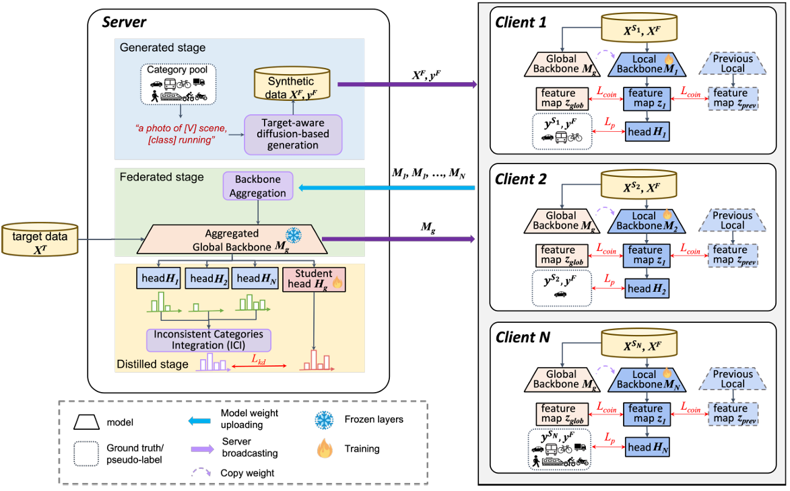

# HeroCrystal: Federated Learning for Object Detection

[](https://arxiv.org/html/2605.02169v1)
[](https://doi.org/10.1016/j.inffus.2026.104413)



This repository contains the official implementation of our federated learning framework for object detection.

## 1. Environment Setup

We provide a `conda` environment file to easily set up dependencies.

```bash
conda env create -f conda_enviroment.yaml
conda activate detectron2
```

## 2. Dataset Preparation

> [!NOTE]
> For more detailed instructions on downloading datasets (Cityscapes, KITTI, Sim10k, BDD100k) and transforming annotations, please refer to our **[Data Preparation Guide](docs/prepare_data.md)**.

To avoid storage issues, it is recommended to store your datasets in a central directory and use symbolic links to link them to the project's `data/` folder.

The dataset parameters used in the configuration files can be set in `pt/data/datasets/builtin.py`.
Example definition: `("VOC2007_citytrain", 'data/VOC2007_citytrain', "train", 8)`

To link the dataset:
```bash
# Example: linking VOC2007 to the local data directory
ln -s /path/to/Cityscapes_dataset/VOC2007 ./data/VOC2007_citytrain
```

## 3. Training Guide

> [!NOTE]
> For tutorials on reproducing main results, resuming training, and running ablations, please refer to our **[Getting Started Guide](docs/get_started.md)**.

### 2-GPU Training

#### CK2B Scenario

**1. Client Training:**
```bash
CUDA_VISIBLE_DEVICES=0,1 python train_net_FedAvg.py \
    --num-gpus 2 \
    --config configs/202405_multiclass/avg03_ck2b.yaml
```
*(After execution, assuming the output folder is `output/avg01_ck2b_so/`, it will contain `FedAvg_2.pth`, and client specific folders like `VOC2007_citytrain_2/`, `VOC2007_kitti5_2/`)*

**2. Server Training:**
```bash
CUDA_VISIBLE_DEVICES=0,1 python train_net_multiTeacher.py \
    --num-gpus 2 \
    --config configs/202405_multiclass/mt03_avg_ck2b_moon.yaml
```

#### SKF2C Scenario

**1. Client Training:**
```bash
CUDA_VISIBLE_DEVICES=0,1 python train_net_FedAvg.py \
    --num-gpus 2 \
    --config configs/202405_multiclass/avg04_skf2c.yaml
```

**2. Server Training:**
```bash
CUDA_VISIBLE_DEVICES=0,1 python train_net_multiTeacher.py \
    --num-gpus 2 \
    --config configs/202405_multiclass/mt04_avg_skf2c_moon.yaml
```

### Other Training Methods

**FedProx (Client Training):**
```bash
CUDA_VISIBLE_DEVICES=0,1 python train_net_unified.py \
    --num-gpus 2 \
    --config configs/202405_multiclass/prox01_ck2b.yaml
```

## 4. Inference

To evaluate a trained model, you can use `train_net.py` with the `--eval-only` flag and provide the path to your trained weights:

```bash
CUDA_VISIBLE_DEVICES=0 python train_net.py \
    --config-file configs/your_config_file.yaml \
    --eval-only \
    MODEL.WEIGHTS /path/to/your/model.pth
```

## 5. Remarks & Configuration Modifications

- **Multiple training sessions:** You can create new config files and modify `DATASET_LIST` to link to other datasets.
- **Output paths:** Modify `OUTPUT_DIR` and `WANDB_Project_Name` (if Weights & Biases is used) in the configuration files.
- **Multi-Teacher training:** For Multi-Teacher configurations, ensure that both `TEACHER_PATH` and `STUDENT_PATH` are properly configured to the correct model weight paths.

## 6. Citation

If you use this project in your research or wish to refer to the results published in the paper, please consider citing our paper:

```bibtex
@article{HeroCrystal2026,
  author={Lu, Peggy Joy and Chen, Wei-Yu and Huang, Yao-Tsung and Tseng, Vincent Shin-Mu},
  title={HeroCrystal: Federated Learning for Object Detection},
  journal={Information Fusion},
  year={2026},
  doi={10.1016/j.inffus.2026.104413}
}
```

## 7. License

This project is released under the Apache 2.0 license. Other codes from open source repositories follow their original distributive licenses.

## 8. Acknowledgement

This project is built upon [Detectron2](https://github.com/facebookresearch/detectron2), Unbiased Teacher, and MOON. We would like to express our appreciation for their excellent works.
